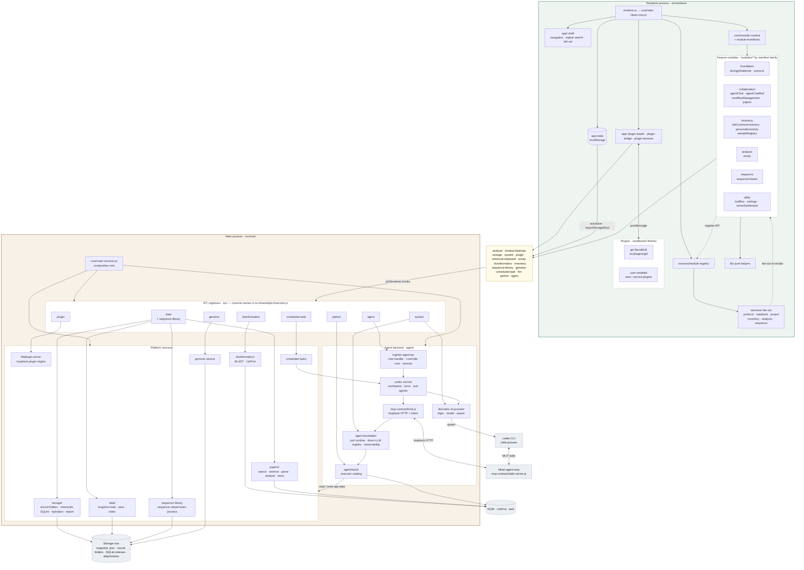
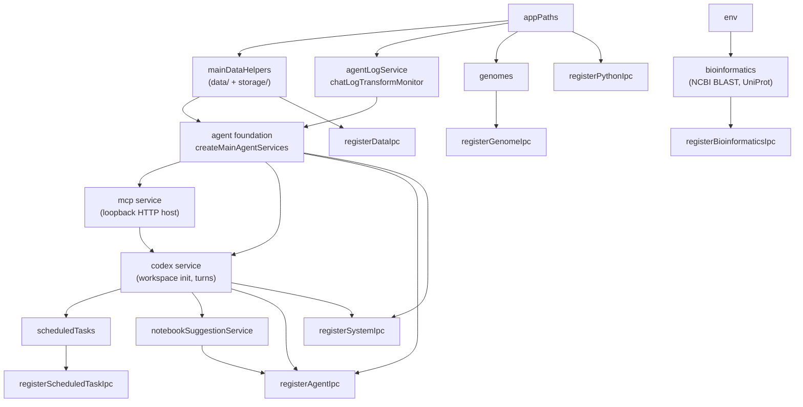
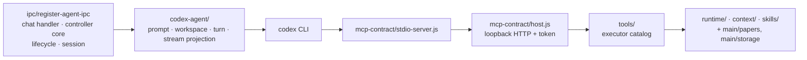
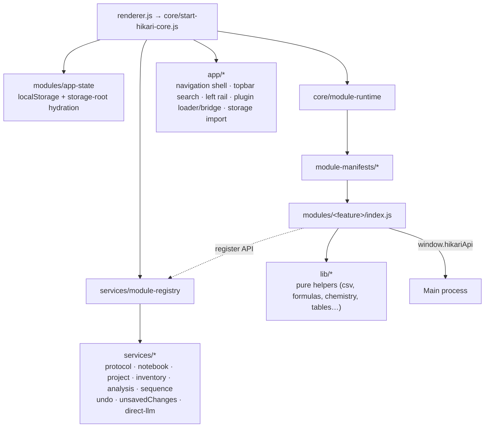
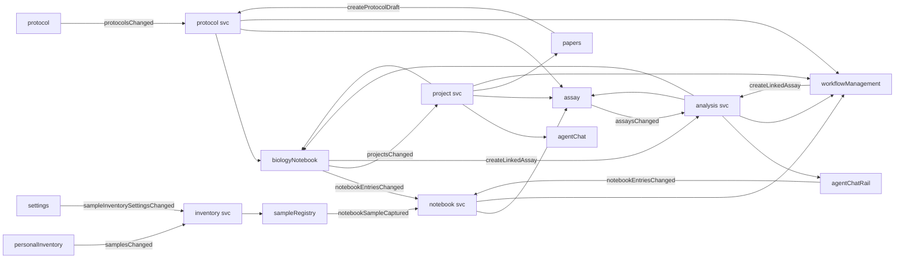

# Hikari Architecture

Topology of Hikari from the whole app down to the module/service layer. For anything below that (files, functions, IPC channel lists) go to [docs/](docs/README.md).

## 1. The app in one picture

Hikari is a local-first Electron desktop app. Everything lives in one storage root on disk: a compact snapshot (`hikari-data.json`) plus one JSON file per record in module-owned folders, with SQLite only where a module searches (chemicals, papers, sequences). There is no hosted backend. AI features shell out to the signed-in `codex` CLI.

Dependency direction is strict: `main/` and `renderer/` both depend on `shared/`; `main/` never imports renderer UI. The single sanctioned exception is the Node-only `renderer/modules/sequence-viewer/main-process/` subtree, which main imports for the sequence library.

## 2. Process boundary

| Layer | Entry | Role |
| --- | --- | --- |
| Main boot | `src/main/main.js` → `app/start-main-app.js` → `core/main-services.js` | Builds every service in dependency order, registers all IPC, then `start()`s best-effort integrations |
| Bridge | `src/main/preload.js` → `preload/create-preload-api.js` | Exposes `window.hikariApi`, one spread per domain API (storage, system, plugin, chemical-clipboard, assay, bioinformatics, inventory, sequence-library, genome, scheduled-task, llm, python, agent) |
| Channel contract | `src/shared/ipc/channels.js` | Only place channel names live |
| Renderer boot | `src/renderer/renderer.js` → `core/start-hikari-core.js` | Loads state, installs plugins, creates registry + services, inits modules from manifests, renders, shows startup view |

### What crosses the bridge

Channel groups in `src/shared/ipc/channels.js`, the preload API that exposes them, the registrar that handles them, and the main service that does the work.

| Channel group | `hikariApi` (preload) | Registrar | Handled by | Used by |
| --- | --- | --- | --- | --- |
| `STORAGE` | `storage-api` — auto-save, pick/import storage root, last-root pointer, chemicals-index sync, ensure dir, store/move/read/open files, write JSON, paper PDF transform and discovery, page logs; protocol-record-saved and paper-file-saved events | `register-data-ipc` | `data/` + `storage/` (+ `papers/` for discovery) | every module that keeps files; app-state autosave |
| `PLUGINS` | `plugin-api` — inspect/serve plugin folder, read/write/export plugin files | `register-plugin-ipc` | `lib/plugin-server`, `lib/plugin-files` | plugin loader / bridge |
| `INVENTORY`, `ASSAY` | `inventory-api`, `assay-api` — parse chemical / assay result import files; `ASSAY.PLOT_REQUEST`/`PLOT_RESPONSE` let the agent ask the open Plate view to draw a live plot | `register-data-ipc`; plot bridge in `core/services/assay-plot-bridge.js` | `lib/chemical-import`, assay parser | Chemicals, Assay |
| — | `chemical-clipboard-api` — read ChemDraw/MOL/SMILES or image clipboard content, write text (Electron `clipboard` in preload, no IPC) | — | — | Samples (chemical structures), Sequence Viewer primer orders, Agent, Settings |
| `SEQUENCE_LIBRARY` | `sequence-library-api` — list/get/upsert/delete entries and folders, annotate, search features, backbones | `register-data-ipc` → `register-sequence-library-ipc` | `sequence-viewer/main-process/sequence-library` (SQLite) | Sequence Viewer, agent sequence tools |
| `AGENT` | `agent-api` — chat + cancel, HTML preview, generate protocol, suggest experiment, list skills, chat-log sessions, log replay; `agent-progress` events back | `register-agent-ipc` | agent backend (Codex runtime, tool runtime, chat logs) | Agent, Home, Protocols, Notebook |
| `LLM`, `SYSTEM` | `llm-api`, `system-api` — Codex login/logout/status/catalog/model/effort, Codex Desktop MCP setup prompt, direct LLM prompts; open external URL, error reporting, open logs folder / third-party notices, app-close handshake | `register-system-ipc` | `lib/codex-cli-provider`, direct-LLM registry, `lib/error-reporting` | Settings, Papers, Protocols, Chemicals, unsaved-changes service |
| `GENOME` | `genome-api` — list/get/add/remove reference genome FASTA files, read a region | `register-genome-ipc` | `genome/` service | exposed on `hikariApi`; no in-app caller yet |
| `BIOINFORMATICS` | `bioinformatics-api` — BLAST and UniProt queries | `register-bioinformatics-ipc` | `bioinformatics/` (remote NCBI/UniProt) | exposed on `hikariApi`; no in-app caller yet (agent smoke test only) |
| `SCHEDULED_TASK`, `PAPER_FINDING` | `scheduled-task-api` — create/list/update/run/delete scheduled Codex tasks; list/create/update/schedule paper-finding tasks and download a found paper | `register-scheduled-task-ipc` | `scheduled-tasks/` service + `papers/finding/` | Home paper finder and Notebook project paper finder |
| `PYTHON` | `python-api` — run a script in the agent's Python sandbox | `register-python-ipc` | `agent/tools/agent-python-sandbox` | plugins (bridge verb) |

## 3. Main process

`createMainServices()` is the only composition root. Construction order (which is also the dependency order):

### Main services

| Service | Folder | What happens |
| --- | --- | --- |
| Data helpers | `main/data/` | Reads and writes the single `.json` snapshot; every save compacts it and syncs the storage bundle; load hydrates missing pieces back from the bundle. |
| Storage | `main/storage/` | Keeps the storage root in step with the snapshot: one JSON file per protocol, notebook page, sample container, assay, workflow, stored paper, and legacy (pre-plugin) gel; the chemicals SQLite index (guarded so an unreadable one is never overwritten); the Home experiment log. Hydrates a snapshot back by scanning those folders; imports a foreign storage root; discovers PDFs dropped into the papers folder. See [storage-and-bundles](docs/main-platform/data/storage-and-bundles.md). |
| Project memory | `main/project-memory/` | Collects project-scoped records and produces the Codex-facing `MEMORY.md`, including the optional LLM-written conclusion. |
| Papers | `main/papers/` | Literature search and retrieval, PDF download, PDF→Markdown parsing, DOI/identity resolution, LLM analysis, the paper knowledge store, and the scheduled "paper finding" workflow. Used by both the Papers module and the agent tools. |
| Sequence library | `renderer/modules/sequence-viewer/main-process/` | SQLite-backed sequence store: entries and folders, GenBank parsing, auto-annotation against the feature database, backbone recognition, summaries for the storage manifest. |
| Bioinformatics | `main/bioinformatics/` | Submits BLAST jobs to NCBI and polls for results; UniProt search and entry lookup. |
| Genome | `main/genome/` | Registry of user-connected reference genome FASTA files with a FASTA index for region reads; paths only ever enter through a user-driven file dialog. |
| Scheduled tasks | `main/scheduled-tasks/` | Persists task definitions (`Config/scheduled-tasks.json` in the storage root), computes calendar recurrences, wakes on schedule, runs each as a Codex task, normalises the run result (e.g. paper finding) for the Home widget. |
| Codex CLI provider | `main/lib/codex-cli-provider/` | Spawns the signed-in `codex` CLI: login flow, model and reasoning-effort config, one-shot text requests, and the long-running turns the agent runtime drives. |
| LLM runtime | `main/lib/llm/` | Provider-neutral prompt/response helpers, the direct-LLM registry that module features call, and a monitor that transforms raw chat logs into session files. |
| Plugin files | `main/lib/plugin-*.js`, `ipc/register-plugin-ipc.js` | Validates a plugin folder against the manifest contract, serves it on its own loopback origin, and handles plugin file read/write confined to a folder under the storage root (symlinks rejected). |
| npm updater | `main/updater/` | Fetches the npm registry metadata for `@hinashirosaki/hikari` at startup, compares versions, and offers the update dialog. |
| Main window | `main/windows/` | Creates the `BrowserWindow` with the preload bridge and navigation guards. |

### Agent backend (`main/agent/`)

Live path: renderer `agent:chat` → chat handler → controller core → Codex runtime spawns/resumes a `codex` turn → Codex calls Hikari tools over MCP (stdio child → loopback host) → tool executors read/write app data → stream events + artifacts normalized back to the renderer.

What the tools do (`mcp-contract/direct-tools/`): look things up in app state (notebook, protocol, inventory, chemical, container), draft or append notebook entries and suggest next experiments, generate and save protocols, build assay tables and Plotly graphs, run literature search / paper download / paper analysis through `main/papers`, sequence tools against the sequence library, purchase recommendations, a Python sandbox, web search, delegated sub-agent turns, and `ask-user` for clarifications. Anything that writes app data comes back as an artifact the renderer shows for review before it persists.

## 4. Renderer

Every feature module gets the same `state`, a shared `persist()`, and callback options from its manifest. Modules never import each other's controllers; cross-module effects go through `services/`, which fan a change out to the registered APIs of other modules.

### Feature modules — what happens in each

Every module owns a slice of `state`, renders its own view, and reaches main only through `window.hikariApi`. "Triggers" are the manifest callbacks that fan out to other modules (next section).

| Dock entry | Registry key(s) | What happens | Owns in `state` | Talks to main for | Triggers |
| --- | --- | --- | --- | --- | --- |
| Home | `homeDashboard` | Widget board: lab timers, an experiment log that saves locally or hands the text to the agent's **Prepare notebook page** dialog, quick notes onto recent notebook pages, contribution heatmap from growth events, cell-passage and overnight-incubation reminders, and the scheduled paper finder. Mostly shortcuts into other modules. | `settings.dashboard`, `growthMetrics` | scheduled-task / paper-finding APIs, agent chat (through the manifest-supplied `createAgent`) | — |
| Protocols | `protocol` | Protocol library CRUD with a structured step editor, JSON import/export, list/preview. Drafting runs through the Codex agent (so it can use web + literature tools); "polish" is a direct-LLM call. Accepts drafts extracted from Papers and protocols the agent saved from main. | `protocols` | agent protocol generation, direct LLM | `onProtocolsChanged` |
| Notebook | `biologyNotebook` | Projects and experiment entries that link a protocol, samples, an assay plate, a gel, and papers. Result tables use the shared formula engine (`lib/formula.js`); imported result files and page logs go into the storage root; PDF export; calculation sidebar; agent notebook drafts are reviewed here before they persist. | `projects`, `notebookEntries` | storage dirs, file import/read, page logs, direct LLM | `onProjectsChanged`, `onNotebookEntriesChanged`, `onCreateLinkedAssay` |
| Papers | `papers` | Local PDF library (folder rail, drag/drop), in-app PDF viewer with anchored comments and highlights, summaries and method extraction via direct LLM. PDFs are stored/moved inside the storage root and rediscovered on hydration. Can turn an extracted method into a protocol draft. | `papers`, `paperExperimentLinks`, comments | file store/move/read, paper discovery, direct LLM, open external | `onCreateProtocolDraft` |
| Samples | `sampleRegistry`, `personalInventory` | Samples recorded inside physical containers (boxes, racks, well grids) with a multi-well editor; CSV round-trip; captures samples mentioned in notebook entries. Location and sample-type vocabularies come from Settings. | `samples` | — | `onSamplesChanged`, `onNotebookSampleCaptured` |
| Chemicals | `labCommonInventory` | Shared reagent inventory: locations with generated codes, lots, stock, and an append-only activity ledger. CSV/XLSX import with header mapping (parsed in main, fields guessed by LLM). Mirrors records into the storage-root SQLite index. | `labInventory` | chemical import parsing, direct LLM, SQLite sync | — |
| Workflows | `workflowManagement` | Graph workflow builder with reusable templates; executions link to projects and notebook entries; result files stored in the storage root. Re-renders whenever protocols, entries, projects, or assays change. | `workflows`, `workflowTemplates` | storage dirs, file import | `onCreateLinkedAssay` |
| Agent | `agentChat`, `agentChatRail` | Chat over app state: sessions and folders, streamed turns and cancel, a compact experiment context built by `experiment-llm-mapper`. Session logs live in main. Review-before-write: agent drafts land in Notebook/Protocols only after the user accepts. The rail is the same controller mounted as a side panel in other views. | `agentChat` | `agent:chat`, cancel, chat-log sessions | `onNotebookEntriesChanged` |
| DNA (Sequence Viewer) | `sequenceViewer` | Sequence library (entries/folders live in a main-process SQLite store), annotation and feature search, restriction analysis, alignment, cloning-route and primer design, protein builder, interactive vector map, backbone recognition, AB1 traces. File-format converters can come from service plugins. | — (library is main-owned) | `sequenceLibrary*` (list/get/upsert/annotate/search/backbones) | — |
| Plate (Assay) | `assay` | Plate layout design and concentration fill, result import (parsed in main), one spreadsheet formula per transformed cell, grouped summaries, curve fitting (linear, sigmoidal, hyperbola, polynomial, Padé), Plotly charts with styling presets. Analysis JSON, chart SVG, and result files are written to the storage root. Opens pre-linked from a notebook entry or workflow. | `assays` | result-file parsing, JSON/file writes | `onAssaysChanged` |
| Tools | `toolBox` | Eight bench calculators (molarity, peptide properties, buffer preparer, fixed-volume reaction, DNA → protein, protein → DNA, oligo properties, extinction coefficient) and an image-based colony counter loaded on demand. Sequence math comes from `sequence-viewer/calculations/`. Can hand a sequence straight to Sequence Viewer. | — | file bytes (images) | `sequence.openFromToolBox` |
| Settings | `settings` | Appearance, startup view, storage root pick and diagnostics, shared vocabularies (locations, sample types), preferred journals, notebook PDF defaults, Codex install/login/model/reasoning effort, Codex Desktop MCP setup prompt, per-tool MCP access, external skills, and plugin install/manage. | `settings` | storage pick, Codex CLI status/login/model, plugins | `onSampleInventorySettingsChanged` |
| (support) | — | `pdf-export/` and `print/` render notebook/protocol pages to PDF or print; `selection-insights/` shows quick stats for a selected table range. | — | — | — |

Manifests are grouped in `module-manifests/index.js` as foundation (notebook, protocol) → collaboration (agent, workflow, papers) → inventory → analysis → sequence → utility, and initialise in that order.

### Renderer services — what happens in each

| Service | What happens |
| --- | --- |
| `module-registry` | Name → module API map, plus bridge entries (`showView`, `VIEWS`). Modules register their public API here at init; services look targets up lazily, so init order never matters. |
| `protocol` | Fan-out when protocols change; JSON import; "open protocol" (switch view + edit); create a draft from a paper's extracted method; accept a protocol the agent saved from main (persisted as an external write, so it does not touch the undo stack). |
| `notebook` | Fan-out when entries change; a separate entry point for agent-created entries that also re-renders the notebook list. |
| `project` | Fan-out when projects change — the widest one (notebook, workflow, assay, papers, agent). |
| `inventory` | Fan-out for samples and for vocabulary settings; "open sample search". |
| `analysis` | Fan-out when assays change; "open assay for notebook entry" (switch view + `startLinkedAssay`). |
| `sequence` | "Open from Toolbox" — load an external sequence and open the detail view. |
| `undoService` | Global undo/redo over persisted state snapshots; edits in the same field coalesce, external (main-process) writes are excluded; a focused plugin frame can claim the undo controls. |
| `unsavedChangesService` | Answers main's close request: collects editors with unsaved changes, shows the quit dialog, replies quit/cancel. |
| `direct-llm` | Builds LLM settings from state and sends one-shot text requests through the Codex CLI for module features (paper summaries, protocol polish, chemical-import guessing). |
| adapters | `direct-llm` (shared prompt transport), `notebook-note-tools` (clarified notes), and the event/service registries. Feature-owned mappers, linked previews, and Samples clipboard parsing live with their renderer modules. |

### Cross-module fan-out (via `services/`)

Who triggers a change, and who re-renders because of it:

Regenerate the exact edge list any time with `npm run report:modules` (writes `reports/renderer-module-relationships.md`).

## 5. Plugins

Plugins are folders of web files mounted as sandboxed iframes, each on its own loopback origin. They talk to the host only via a permission-gated `postMessage` bridge (`renderer/app/plugin-bridge.js`); they never get renderer imports, preload, or filesystem access.

- **View plugins** add a dock workspace (behind **More**). Internal ones ship in `src/plugins/<id>/` (today: `gel`); user-installed ones come from a folder via Settings.
- **Service plugins** are headless and register a capability (e.g. a file-format converter consumed by the Sequence Viewer) through `renderer/app/plugin-services.js`.

Details: [docs/plugins/](docs/plugins/README.md).

## 6. Build-time generated glue

`npm run build:ui` compiles `ui/` into `index.html`, `styles.css`, `src/renderer/modules/views.js`, and `src/renderer/modules/app-registry.generated.js`, and writes both `codex-model-catalog.generated.js` files (renderer and `src/main/generated/`) from the provider stub in `scripts/build-ui/llm-catalog.mjs`. None of these are committed. Hikari ships no model list; the model catalog is asked from Codex at runtime. Dock order, labels, aliases, and search scopes therefore start in `ui/config/app-registry.json`, not in renderer code.

## Going deeper

- Renderer boot, state, search → [docs/renderer/](docs/renderer/README.md)
- Main persistence, storage bundles, IPC registrars → [docs/main-platform/](docs/main-platform/README.md)
- Agent request lifecycle, tools, MCP contract → [docs/agent/](docs/agent/README.md)
- Adding a module → [docs/module-development/](docs/module-development/README.md)
