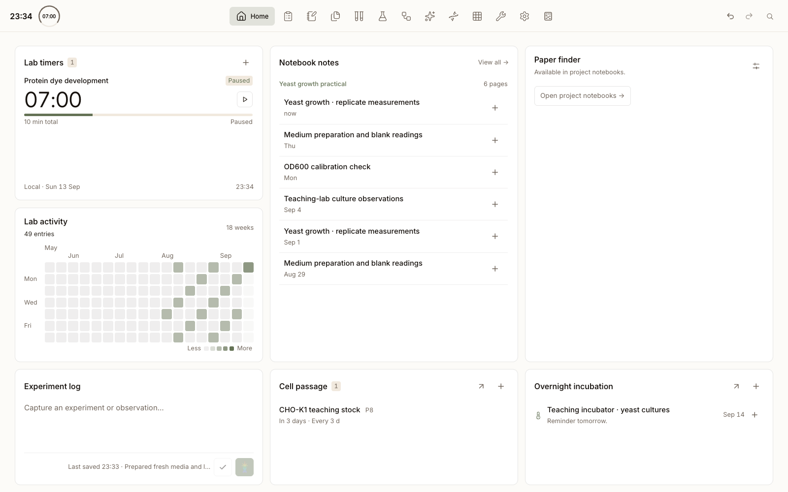

<div align="center">


# Hikari

**A local-first lab workspace for the bench — planning, protocols, records, analysis, papers, and AI, all on your machine.**

<p>
  
  
  
  
  
</p>

<a href="#quick-start">Quick Start</a> ·
<a href="docs/getting-started/first-experiment.md">Tutorial</a> ·
<a href="#app-surface">Features</a> ·
<a href="#plugins">Plugins</a> ·
<a href="#ai-and-agent-setup">AI Setup</a> ·
<a href="#data-and-storage">Data</a> ·
<a href="#development">Development</a> ·
<a href="#troubleshooting">Troubleshooting</a>

</div>



<sub>Home dashboard shown with fictional biology demo data. No private project records are included.</sub>

Hikari is a local-first Electron desktop app for day-to-day lab work. It brings project planning, protocol management, experiment records, assay analysis, paper review, sequence inspection, and optional AI assistance into one desktop workspace — no hosted backend required.

## Highlights

- Local desktop app built with Electron — your data stays on your machine.
- Twelve dock workspaces: `Home`, `Protocols`, `Notebook`, `Papers`, `Samples`, `Chemicals`, `Workflows`, `Agent`, `Sequence Viewer`, `Assay`, `Tools`, and `Settings`.
- One storage root holds every heavy file — notebook attachments, papers, assay artifacts, gels, and sequence assets — next to a single `.json` snapshot.
- Modules cross-link: a notebook entry can pull in a protocol, a sample, an assay plate, a gel record, and a paper without leaving the page.
- Optional LLM-backed features for `Papers`, `Protocols`, and `Agent`, all through the signed-in `codex` CLI.
- Sandboxed plugins for extra workspaces — `Gel` ships as an internal bundled plugin ([src/plugins/gel](src/plugins/gel/)).

## App Surface

Every workspace below is one dock entry. The dock order is the order shown here; plugin workspaces live behind the **More** button at the end of the dock.

> **Screenshots:** `docs/screenshots/home.png` is the only image checked in so far. Each module section carries a `<!-- SCREENSHOT: ... -->` comment naming the file to add and what it should show. Drop the PNG in `docs/screenshots/` and replace the comment with a normal image tag.

### Module index

| Module | One-liner |
| --- | --- |
|  [`Home`](#home) | Bench dashboard: timers, quick notes, contribution heatmap, and recurring reminders. |
|  [`Protocols`](#protocols) | Protocol library with a structured editor, JSON import/export, and LLM drafting. |
|  [`Notebook`](#notebook) | Projects and protocol-linked experiment records with result tables and PDF export. |
|  [`Papers`](#papers) | Local PDF library, anchored comments, summaries, and method extraction. |
|  [`Samples`](#samples) | Sample registry inside physical storage containers, with CSV round-trip. |
|  [`Chemicals`](#chemicals) | Shared reagent inventory with locations, lots, and activity history. |
|  [`Workflows`](#workflows) | Graph workflow builder with reusable templates and project linkage. |
|  [`Agent`](#agent) | Evidence-grounded assistant over app state, with review-before-write drafts. |
|  [`Sequence Viewer`](#sequence-viewer) | Sequence library, annotation, restriction analysis, alignment, and cloning design. |
|  [`Assay`](#assay) | Plate design, result capture, spreadsheet formulas, and curve-fitting analysis. |
|  [`Tools`](#tools) | Ten bench calculators plus an image-based colony counter. |
|  [`Settings`](#settings) | Storage root, startup, appearance, model access, plugins, and shared vocabularies. |

---

### Home

 The launch dashboard. It is a widget board rather than a single view, so most of it is a shortcut into another module.

- **Lab timers** — named countdown timers for incubations, spins, and washes.
- **Quick Add Notes** — append a note straight onto a notebook page without opening `Notebook`.
- **Add Experiments** — log an experiment or notebook entry from one input box.
- **Contribution heatmap** — calendar-style activity view across your records.
- **Cell passage** — track cell line, passage number, and split ratio; surfaces the next due passage.
- **Overnight incubation** — record what is incubating and where, against your configured location list.
- **Scheduled paper finding** — recurring literature sweep against your preferred journals (see [`Papers`](#papers)).

<!-- SCREENSHOT: docs/screenshots/home-widgets.png — close-up of the timer, cell-passage, and contribution-heatmap widgets -->

### Protocols

 A structured protocol library. Protocols are records, not free text, so `Notebook` can snapshot them into an experiment and keep the version that was actually run.

- **Structured editor** — name, purpose, materials, numbered steps, and troubleshooting notes as separate fields.
- **Interactive bars** — parameterize a step (volume, temperature, time) so the value can be set per run instead of edited into the text.
- **Import / export** — read and write protocol JSON; share a protocol as a file.
- **Generate Protocol** — draft a protocol from a description, pasted methods, notes, images, or a PDF.
- **Polish Protocol** — clean up an existing draft while showing your original input side by side.
- **Notebook placeholders** — leave fields for the experimenter to fill in when the protocol is used in a record.

<!-- SCREENSHOT: docs/screenshots/protocols-editor.png — protocol editor with steps and an interactive bar -->
<!-- SCREENSHOT: docs/screenshots/protocols-generate.png — the Generate Protocol dialog with a generated draft -->

### Notebook

 The wet-lab record, and the home of projects. Everything else in the app can be linked into an entry.

- **Projects** — create projects, pick an active project, and see a per-project dashboard. There is no separate Projects module; project selection lives here and scopes `Papers` and `Agent`.
- **Experiment entries** — start an experiment from a protocol, which snapshots the protocol text and fills in its placeholders.
- **Result tables** — add tables with configurable rows/columns and spreadsheet-style formulas (the same formula engine `Assay` uses).
- **Linked previews** — embed assay plates and gel records inline; the preview reads the owning module's saved record.
- **Samples and reagents** — quick-add a sample or attach a reagent from `Samples`/`Chemicals` without leaving the entry.
- **Notebook calculators** — a buffer and fixed-volume-reaction sidebar that writes its result straight into the record.
- **Attachments and storage** — imported result files and an append-only page log under the storage root.
- **PDF export** — export an entry, with its tables and previews, as a PDF.
- **Agent rail** — a project-scoped assistant panel docked beside the entry.

<!-- SCREENSHOT: docs/screenshots/notebook-entry.png — an experiment entry with a snapshotted protocol and a result table -->
<!-- SCREENSHOT: docs/screenshots/notebook-project-dashboard.png — project dashboard listing entries -->

### Papers

 A local PDF library with a real viewer, not a file list. Search, download, parsing, and analysis run in the main process under [`src/main/papers/`](src/main/papers/).

- **Library rail** — nested folders, drag-and-drop filing, rename/delete, and project linkage.
- **Upload or fetch** — add a local PDF, or search the paper database and download the PDF into the library.
- **PDF viewer** — page rendering, zoom, in-document search, and text selection.
- **Anchored comments** — pin a comment to a location on the page; edit it from the sidebar.
- **Summaries and methods** — generate a summary or extract the methods section into structured text.
- **Project-scoped Q&A** — ask questions across the papers linked to the current project.
- **Scheduled finding** — recurring searches against the journals configured in `Settings > Preferred Journals`, surfaced on `Home`.
- **Agent rail** — the assistant panel, scoped to the open paper and project.

<!-- SCREENSHOT: docs/screenshots/papers-viewer.png — PDF viewer with the library rail and an anchored comment -->
<!-- SCREENSHOT: docs/screenshots/papers-summary.png — generated summary and extracted methods panel -->

### Samples

 One workspace covering both physical storage containers and the samples inside them — the container view and the registry render together.

- **Storage containers** — define boxes, racks, and freezers, then record samples directly into a position.
- **Sample types** — plasmids, cell lines, strains, antibodies, proteins, compounds, and primers; type names are editable in `Settings > Samples`.
- **Chemical structures** — compound samples carry structure data and a rendered preview.
- **CSV import / export** — bulk-load a registry or export it for a shared sheet.
- **Cell passage tracking** — passage records that feed the `Home` reminder widget.
- **Notebook capture** — push a sample into the open notebook entry, or create one from an entry.

<!-- SCREENSHOT: docs/screenshots/samples-registry.png — container grid beside the sample detail panel -->

### Chemicals

 The shared reagent inventory, kept separate from personal samples because it is the lab-wide stock list.

- **Searchable records** — search by name or catalog identity from the topbar.
- **Locations and lots** — where the bottle lives and which lot is open.
- **Activity history** — a record of stock changes over time.
- **Fast lookup** — indexed on disk (`hikari-chemicals.index.sqlite`) so search stays quick on large inventories.

<!-- SCREENSHOT: docs/screenshots/chemicals-list.png — chemical list with the detail panel open -->

### Workflows

 Plans a multi-day experiment as a graph rather than a checklist, so branches and parallel tracks are visible.

- **Graph editor** — drag nodes, connect steps, and lay out branches directly.
- **Templates** — save a workflow as a reusable template and instantiate it for a new run; templates are searchable.
- **Protocol blocks** — pull protocol steps into a node instead of retyping them.
- **Assignees and next steps** — default-assignee resolution and next-step planning.
- **Project linkage** — attach a workflow to a project; progress shows on `Home`.

<!-- SCREENSHOT: docs/screenshots/workflows-graph.png — graph editor with a branching workflow -->
<!-- SCREENSHOT: docs/screenshots/workflows-templates.png — template library -->

### Agent

 The assistant workspace. It answers from your actual records, and anything it wants to write goes through a review card first.

- **Sessions** — multiple named sessions, organized in folders, with history.
- **Project context** — pick the project scope; the assistant reads a compact snapshot of that project's state.
- **Grounded tools** — it can look up notebook entries, protocols, samples, chemicals, containers, and papers; run literature search and paper download/analysis; read assay tables; build Plotly graphs; and suggest purchases.
- **Review before write** — generated notebook drafts and protocols land as review cards you approve or reject; the owning module, not the assistant, defines the record schema.
- **Side rail** — the same chat mounts as a rail inside `Papers`, `Notebook`, and `Assay`, scoped to what is open there.

Backend details are in [`docs/agent/README.md`](./docs/agent/README.md).

<!-- SCREENSHOT: docs/screenshots/agent-session.png — chat session with a grounded answer citing records -->
<!-- SCREENSHOT: docs/screenshots/agent-review-card.png — the Review Generated Drafts overlay -->

### Sequence Viewer

 The largest workspace — read it as several cooperating tools sharing one sequence library.

- **Import** — `.gbk`, `.gb`, `.gbff`, `.fasta`, `.fa`, `.fas`, `.fna`, `.fastq`, `.fq`, `.seq`, `.txt`, or pasted text.
- **Library** — nested folders, rename, move, and a saved/unsaved indicator per record.
- **Detail view** — sequence inspection with feature annotations, hover detail, and inline feature editing.
- **ORF analysis** — open reading frame detection and translation overlays.
- **Restriction analysis** — cut-site detection against a commercial enzyme catalog, with an enzyme picker.
- **Alignment** — align against a pasted sequence or a chosen file.
- **Protein Builder** — assemble a protein from blocks and build the DNA sequence back out.
- **Cloning design** — plan a Gibson/HR assembly or a vector insert, design primers, and export IDT bulk-input blocks or CSV.

<!-- SCREENSHOT: docs/screenshots/sequence-library.png — sequence library with folders -->
<!-- SCREENSHOT: docs/screenshots/sequence-detail.png — detail view with annotated features and a translation overlay -->
<!-- SCREENSHOT: docs/screenshots/sequence-cloning.png — cloning design step with designed primers -->

### Assay

 Plate-based data capture and analysis. The mental model is: define the plate → map the wells → paste results → analyze → save one normalized record.

- **Plate layout** — define the plate, fill concentrations across a row or column, and edit sample IDs per well.
- **Serial dilution** — a dilution dialog that computes the recipe and writes the concentrations into the layout.
- **Inventory picker** — apply a sample ID from `Samples` to a well from its context menu.
- **Result import** — paste a matrix, or import `.csv` / `.xls` / `.xlsx`; plate-sized matrices are detected and offered for mapping.
- **Formulas** — spreadsheet-style formulas per cell for background subtraction and normalization, parsed (never `eval`'d) with function names and arity checked as you type.
- **Analysis** — grouped summaries plus curve fitting (linear, sigmoidal, hyperbola, polynomial, Padé) and normalize-to-baseline dose response.
- **Charts** — Plotly figures with a Format rail, saved style presets, and figure export.
- **Artifacts** — analysis JSON, chart SVG, and attached result files stored under the storage root.
- **Agent rail** — the assistant panel, scoped to the open plate.

<!-- SCREENSHOT: docs/screenshots/assay-layout.png — plate layout editor with concentration fill -->
<!-- SCREENSHOT: docs/screenshots/assay-analysis.png — dose-response curve fit with the grouped summary table -->

### Tools

 Small bench calculators in one workspace. Each is its own subview, switched from the tool rail; the colony counter loads on demand because it is the heavy one.

| Tool | What it computes |
| --- | --- |
| Mass Molarity Calculator | mass ↔ molarity ↔ volume, with concentration and dilution panels in the same view |
| Buffer Preparer | buffer recipes from a shared compound dataset |
| Fixed Volume Reaction | reaction mixes at a fixed final volume |
| qPCR Efficiency Calculator | amplification efficiency from a standard curve |
| CRISPR sgRNA Designer | guide candidates for a target sequence |
| DNA / RNA Oligo Properties | Tm, GC content, and oligo properties |
| DNA Sequence to Protein | translation |
| Protein Sequence to DNA | reverse translation, with a restriction-site avoidance list |
| Peptide Property Calculator | peptide mass and properties |
| Extinction Coefficient Calculator | extinction coefficient from sequence |
| Colony Counter | image-based colony counting with annotated output (loaded on demand) |

<!-- SCREENSHOT: docs/screenshots/tools-molarity.png — the tool rail with the molarity calculator open -->
<!-- SCREENSHOT: docs/screenshots/tools-colony-counter.png — colony counter with annotated colonies -->

### Settings

 Configuration, plus the shared vocabularies other modules read from.

| Section | What it controls |
| --- | --- |
| Appearance | Theme and workspace look. |
| Storage | The storage root folder — the one setting to get right first. |
| Startup | Default startup module, or "remember last opened module". |
| Inventory Locations | The shared location vocabulary used by `Chemicals` and `Home`. |
| Samples | Storage locations and the editable sample type names used by `Samples`. |
| Preferred Journals | Journal names or URLs for `Papers` search and scheduled finding. |
| Codex Model & Access | Model choice, reasoning effort, and Codex sign-in status. |
| External Skills | Agent skill files loaded from disk. |
| Genomes | Connect local genome files and refresh the connected list. |
| Plugins | User plugin folders; enable or disable plugin workspaces. |

<!-- SCREENSHOT: docs/screenshots/settings-storage.png — Settings with the storage root configured -->

## Plugins

Plugin workspaces run in a sandboxed iframe with a declared permission list, and appear behind the dock's **More** button. See [`docs/plugins/plugin-system.md`](./docs/plugins/plugin-system.md) for the folder format and install flow.

### Gel (bundled)

[`src/plugins/gel`](src/plugins/gel/) ships with the app and cannot be removed, only turned off in `Settings > Plugins`.

- Image and TIFF ingestion, crop, free rotation, and enhancement.
- Lane segmentation, ladder calibration, band quantification, and peak editing.
- Saved gel records, reports, and CSV export.
- PNG export at up to 4× raster density; PowerPoint export keeps the lane table as an editable native table.

It requests only `storage`, `files`, `downloads`, and `layout` — it has no notebook, project, sample, or protocol access. `Notebook` and `Agent` can still *display* saved gel records by reading the plugin's persisted index; that one-way read does not grant the iframe anything.

<!-- SCREENSHOT: docs/screenshots/gel-analysis.png — lane segmentation with a quantified band table -->

## Quick Start

New to Hikari? Follow the **[15-minute first experiment tutorial](./docs/getting-started/first-experiment.md)** to configure storage and carry one fictional experiment from sample registration through a saved notebook result.

### Install Hikari with an agent

Copy and paste this prompt into a coding agent that has terminal access:

```text
Download and install Hikari from its official repository:
https://github.com/HinaShirosaki/Enana

Please complete the installation for me:

1. Detect my operating system and CPU architecture.
2. Confirm that Git, Node.js 20 or newer, and npm are available. If a prerequisite is missing, explain what is needed and ask before installing system software or requesting administrator privileges.
3. Clone the repository into a sensible user-owned location. If the private repository requires authentication, ask me to sign in through GitHub's normal login flow; never ask me to paste a token into the chat or print credentials.
4. In the cloned repository, install the locked dependencies with `npm ci`, then build the native distribution with `npm run dist`.
5. Find the artifact for my platform under `out/` and install Hikari using the normal convention for my operating system. Ask before overwriting an existing installation or making a system-wide change, and do not bypass operating-system security checks.
6. Launch Hikari once and confirm that it opens. Report the repository path, build artifact, installed application path, and any step I still need to complete.

Preserve any existing Hikari application data. Do not choose or change the Hikari storage root, and do not sign in to Codex on my behalf.
```

### Prerequisites

- Node.js 20+
- npm

### Install and run

```bash
npm install
npm run start
```

### First launch checklist

1. Open `Settings > Storage` and set the **Root Folder Path**. Do this before anything else — notebook attachments, papers, assay artifacts, gels, and sequence assets all live under it, and auto-save is off until it is set.
2. In `Settings > Startup`, pick a default module or enable "remember last opened module".
3. In `Settings > Samples` and `Settings > Inventory Locations`, set your storage locations and sample type names — the inventory modules read these.
4. Sign in to the Codex CLI if you want `Agent`, paper summaries, or protocol generation (see below).

## AI and Agent Setup

Configure AI features in `Settings > Codex Model & Access`.

The Agent workspace uses:

- `Codex Agent (CLI)`

The model catalog is [`config/codex-models.json`](./config/codex-models.json). All LLM-backed features use the signed-in `codex` CLI; no API endpoint or API key is stored by the app.

### Codex Agent Setup

1. Install the `codex` CLI and make sure it is available on `PATH`.
2. Run `codex login`.
3. In `Settings > Codex Model & Access`, optionally choose a model and reasoning effort.

## Data and Storage

Hikari keeps state in three layers:

| Layer | Where | What lives there |
| --- | --- | --- |
| Renderer state | `localStorage` key `hikari_state_v1` | Fast UI state, loaded on boot |
| Snapshot | `hikari-data.json` in the storage root | The saved record set |
| Storage root | The folder you set in `Settings > Storage` | Every heavy file, in named subfolders |

Inside the storage root you will find `Papers/` and `papers.md/`, `Assays/`, `Gels/`, `Samples/`, `Protocol/`, and `KnowledgeBase/`, alongside the snapshot file and the SQLite search indexes for chemicals and protocols.

Notes:

- The snapshot is a `.json` file; the default filename is `hikari-data.json`.
- Auto-save runs whenever a storage path is set. Without one, nothing is written to disk.

Backup suggestions:

1. Back up the whole storage folder, not just the snapshot file — the snapshot alone does not contain your PDFs, gels, or attachments.
2. Periodically copy a dated snapshot out of the root.

## Development

Generated files are part of the normal workflow. Do not hand-edit `index.html`, `styles.css`, or generated config modules unless you also update their source inputs.

### Useful commands

| Command | What it does |
| --- | --- |
| `npm run build:ui` | Generates `index.html`, `styles.css`, and generated provider/app-registry modules from `ui/` and `config/`. |
| `npm run check:dom-ids` | Verifies `document.getElementById(...)` calls against generated `index.html`. |
| `npm run report:modules` | Reports module relationships for the codebase. |
| `npm run start` | Builds the UI, then starts Electron in development mode. |
| `npm test` | Builds the UI, runs DOM ID checks, and executes `node test.js`. |
| `npm run package:app` | Creates packaged app artifacts with Electron Forge. |
| `npm run dist` | Builds installer/distribution artifacts with Electron Forge. |

Packaging notes:

- macOS builds produce a zip package
- Windows builds use Squirrel
- Linux builds use `deb` and `rpm`
- Build artifacts are written under `out/`

### Tests

- `test.js` is the main test entrypoint.
- `tests/suites/core/` covers app modules, contracts, and agent flows.
- `tests/suites/edge/` covers regression-style and edge-case suites.

### Where a module's code lives

Renderer workspaces are folder modules under `src/renderer/modules/<feature>/index.js`, registered through `module-manifests/`. A module captures DOM nodes once, mutates the shared `state`, and calls the shared `persist()` — modules do not own their own persistence.

| Module | Renderer folder | Main-process half |
| --- | --- | --- |
| Home | `modules/home-dashboard.js` + `home-dashboard/` | — |
| Protocols | `modules/protocol/` | `src/main/storage/` (protocol index) |
| Notebook | `modules/biology-notebook/` | — |
| Papers | `modules/papers/` | `src/main/papers/` (search, download, parse, retrieve, analysis, finding) |
| Samples | `modules/sample-registry/` + `modules/personal-inventory/` | — |
| Chemicals | `modules/lab-common-inventory/` | `src/main/storage/` (chemicals index) |
| Workflows | `modules/workflow/` | — |
| Agent | `modules/agent-chat/` | `src/main/agent/` |
| Sequence Viewer | `modules/sequence-viewer/` | `modules/sequence-viewer/main-process/` |
| Assay | `modules/assay/` | — |
| Tools | `modules/tool-box.js` + `tool-box/` | — |
| Settings | `modules/settings/` | `src/main/core/main-services.js` |
| Gel (plugin) | `src/plugins/gel/` | served plugin runtime |

## Project Layout

- `src/main/app/start-main-app.js`: Electron main process, window lifecycle, IPC wiring, and LLM integration.
- `src/main/core/main-services.js`: constructs main-process services in dependency order and registers IPC.
- `src/main/storage/`: storage-bundle import/export, persistence, and sequence-library summary logic.
- `src/main/data/`: primary snapshot and data-helper utilities.
- `src/main/agent/`: Codex integration, MCP contracts, tool adapters, context, and agent runtime support.
- `src/main/papers/`: paper search, download, parsing, retrieval, analysis, and scheduled finding.
- `src/main/ipc/`: IPC registrars; channel names are centralized in `src/shared/ipc/channels.js`.
- `src/main/lib/`: process-level integrations and shared utilities (Codex agent launcher, LLM runtime, app-paths).
- `src/renderer/`: renderer shell, feature modules, shared state, and service layer.
- `src/plugins/`: bundled plugin workspaces.
- `ui/html/` and `ui/css/`: source fragments used to generate the shipped `index.html` and `styles.css`.
- `ui/config/app-registry.json`: source-of-truth dock order, labels, aliases, and search wiring.
- `config/codex-models.json`: Codex model catalog used to generate renderer and main-process model metadata modules.
- `docs/`: internal walkthroughs for renderer, main helpers, plugins, and the agent backend.

## Internal Docs

If you are onboarding to the codebase, start with the docs index and then the area you need:

- [`docs/README.md`](./docs/README.md) — internal docs index and architecture overview
- [`docs/renderer/README.md`](./docs/renderer/README.md)
- [`docs/main-platform/README.md`](./docs/main-platform/README.md)
- [`docs/agent/README.md`](./docs/agent/README.md)
- [`docs/plugins/plugin-system.md`](./docs/plugins/plugin-system.md) — plugin format, install flow, and sandboxing
- [`docs/module-development/README.md`](./docs/module-development/README.md) — how to add a new module
- [`tests/README.md`](./tests/README.md)

## Troubleshooting

<details>
<summary><strong>The app opens but my data is missing</strong></summary>

- Open `Settings > Storage` and confirm the root folder path points at the folder you expect.
- Nothing is written to disk until a storage path is set.

</details>

<details>
<summary><strong>Papers or Agent says Codex is unavailable</strong></summary>

- Sign in with `codex login` and reopen `Settings > Codex Model & Access` to refresh the status.

</details>

<details>
<summary><strong>Codex mode is selected but nothing responds</strong></summary>

- Confirm `codex` is installed and available on `PATH`.
- Run `codex login`.

</details>

<details>
<summary><strong>File imports or paper uploads fail with path-related errors</strong></summary>

- Make sure the storage root is set in `Settings > Storage`.
- Re-open the relevant module after saving the path.

</details>

<details>
<summary><strong>A plugin workspace is missing from the dock</strong></summary>

- Plugin workspaces live behind the **More** button at the end of the dock.
- Check that it is enabled in `Settings > Plugins`.

</details>

<details>
<summary><strong>Packaging fails</strong></summary>

- Re-run `npm install`.
- Confirm Electron Forge dependencies are present for your platform.

</details>
