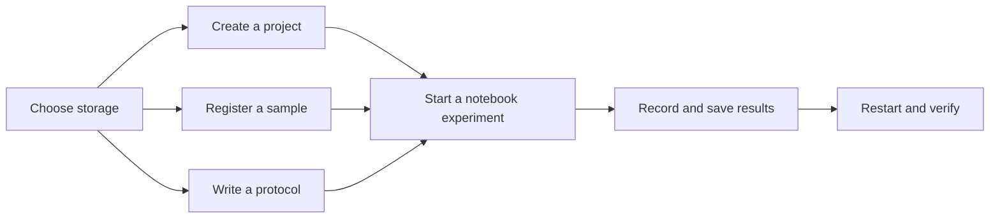

# Your first Hikari experiment

This tutorial takes one fictional GFP expression experiment from setup to a saved notebook result. It exercises the core Hikari workflow without requiring Codex or any other AI feature.

- **Time:** about 15 minutes
- **You will create:** one storage root, project, sample, protocol, notebook page, and result table



> Everything below is fictional demonstration data. Substitute real identifiers and measurements when you use the workflow for lab work.

## Before you begin

Install and launch Hikari using the [Quick Start](../../Readme.md#quick-start). Keep the app open while you work through the steps.

If you are evaluating Hikari, create an empty folder named `Hikari Tutorial` somewhere you control. You can delete it after the tutorial. If you are setting up a real workspace, use the folder you intend to back up as your Hikari storage root.

## 1. Choose the storage root

Hikari needs a storage root before it can write records and attachments to disk.

1. On first launch, click **Choose Folder** on the welcome page.
2. Choose your `Hikari Tutorial` folder or an existing Hikari workspace. You can create a folder in the picker.
3. Wait for Hikari to open the workspace. If the folder cannot be opened or saved, the page shows an error so you can retry.

To change folders later, open **Settings > Storage & data**, click **Select Folder**, and choose the new folder. The chosen path appears under **Root Folder Path**.

Do not move or rename the folder while Hikari is running. For real work, back up the entire folder rather than only the `hikari-data.json` snapshot; attachments and module artifacts live beside it.

## 2. Create a project

Projects group notebook pages and the work linked to them.

1. Open **Notebook** from the dock.
2. Click the **+** button in the top bar. Its tooltip and accessible name are **New project**.
3. Enter:

   - **Project name:** `GFP expression pilot`
   - **Add a description** (optional; expand it first): `Small pilot comparing GFP expression across two replicate cultures.`

4. Click **Create project**.

The new project appears in the Notebook rail and opens its project dashboard.

## 3. Register the sample

Registering the sample first lets Hikari suggest and link it when you fill the protocol placeholders in the notebook.

1. Open **Samples** from the dock.
2. Fill the sample form with:

   | Field | Tutorial value |
   | --- | --- |
   | Sample Code | `STR-GFP-001` |
   | Sample Name | `BL21(DE3) / pET28a-GFP` |
   | Type | `Strain` |
   | Lot / Batch | `DEMO-01` |
   | Storage Type | `Freezer` |
   | Notes | `Fictional tutorial sample; kanamycin resistant.` |

3. Leave the optional container and position fields empty.
4. Click **Save Sample**.

The record should appear under **Registered Samples**. Selecting it again should restore the values you entered.

## 4. Write a reusable protocol

Protocols are reusable records. Starting an experiment from one creates a notebook-specific snapshot, so later edits to the library protocol do not rewrite the experiment record.

1. Open **Protocols** from the dock.
2. Click **Create Protocol**. When protocols already exist, use the document-plus icon at the top of the protocol rail; its tooltip is also **Create protocol**.
3. Enter the following values:

   **Protocol Name**

   ```text
   Small-scale GFP expression check
   ```

   **Purpose**

   ```text
   Compare growth and endpoint GFP fluorescence across two replicate cultures.
   ```

   **Materials**

   ```text
   • LB medium
   • Kanamycin
   • IPTG
   • Culture tubes
   • Plate reader
   ```

   **Steps**

   ```text
   • Inoculate [strain] into 5 mL LB containing kanamycin.
   • Grow at 37°C to OD600 0.6.
   • Add IPTG to a final concentration of 0.5 mM.
   • Incubate at [temperature] for [time].
   • Record OD600 and GFP fluorescence for two replicate cultures.
   ```

4. Click **Save Protocol**.

Text in square brackets becomes an interactive bar in a notebook experiment. You can type those markers directly, use the preset buttons above **Steps**, or type a custom bar name such as `strain` in the **Custom** field and click **Insert**.

## 5. Start the notebook experiment

1. Return to **Notebook**.
2. Click **New Experiment** at the top of the left rail.
3. In the dialog, choose **GFP expression pilot** under **Project**.
4. Under **Search & Select Protocol**, search for `GFP` and select **Small-scale GFP expression check** from the results.
5. Click **Start Experiment**.

The notebook page contains a snapshot of the protocol. Fill its interactive bars:

1. Click **[strain]**, type `BL21`, and choose **BL21(DE3) / pET28a-GFP** from the candidate list. Choosing the candidate creates a real sample link; plain free text remains valid if you do not want a link.
2. Click **[temperature]**, enter `25°C`, and press **Enter**.
3. Click **[time]**, enter `4 h`, and press **Enter**.

## 6. Record a result table

1. Open the briefcase-shaped **Bench toolbox** on the right side of the notebook page.
2. Click the grid icon whose tooltip is **Add table**.
3. Keep **Columns** at `3`, keep **Rows** at `3`, and click **Add Table**.
4. Enter this small fictional dataset by cell address:

   | Row | A | B | C |
   | --- | --- | ---: | ---: |
   | 1 | `Replicate 1` | `0.82` | `18240` |
   | 2 | `Replicate 2` | `0.79` | `17610` |
   | 3 | `Mean` | `=AVERAGE(B1:B2)` | `=AVERAGE(C1:C2)` |

   Column B represents OD600 and column C represents GFP fluorescence in arbitrary units for this tutorial.

5. In the **Notes** field, enter:

   ```text
   Both fictional replicates reached similar density and showed GFP fluorescence. No contamination was noted in the tutorial record.
   ```

6. Click the notebook-page save icon. Its tooltip is **Save notebook page**.

## 7. Restart and verify persistence

1. Quit Hikari normally. If Hikari asks about unsaved changes, choose **Save & Quit**.
2. Reopen Hikari.
3. Open **Notebook**, expand **GFP expression pilot**, and select the saved experiment.
4. Confirm that the filled protocol values, linked strain, result table, formulas, and notes are present.
5. Open **Samples** and **Protocols** once more to confirm that the sample and reusable protocol remain available.

You have completed the core Hikari loop: reusable records fed a project-scoped experiment, the experiment captured structured results, and the complete workspace persisted locally.

## Where to go next

- Link a **Plate** assay, gel, or attachment from the notebook page.
- Import a sequence into **DNA** (the Sequence Viewer) and save it to the sequence library.
- Add a paper PDF and link it to **GFP expression pilot**.
- Configure Codex only when you are ready to use **Agent**, protocol generation, or paper analysis; none of those features are required for local record keeping.

See the [Hikari Guide](../guide/README.md) for the complete feature and setup reference.
